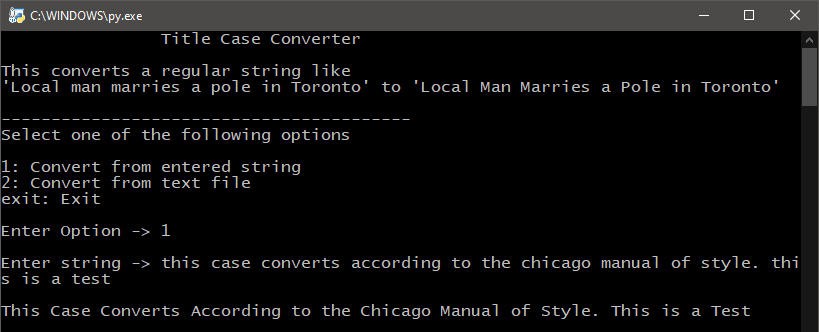

# Title Case Converter

Converts an input string into title case according to the Chicago Manual of Style, with capitalization for non-grammatrical words. This may be useful, for example, in article headlines and content creation platforms.